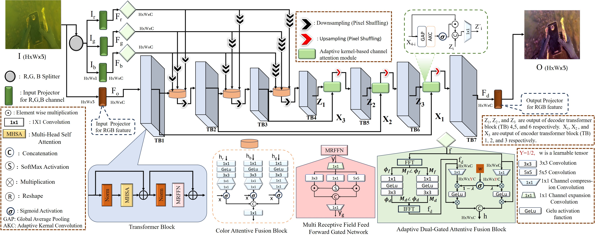

# ACFTNet
Attentive Color Fusion Transformer Network (ACFTNet) for Underwater Image Enhancement (Code will be provided soon).

Abstract:Underwater imagery often suffers from issues like color distortion, haze, and reduced visibility due to light’s interaction with water, posing challenges for applications like autonomous underwater vehicles. To address these obstacles effectively, we introduce the Attentive Color Fusion Transformer Network (ACFTNet) for underwater image enhancement. At the core of our proposal lies a novel Adaptive Dual-Gated Attentive Fusion Block (ADGAFB), which seamlessly integrates localized transmission features and global illumination characteristics. Subsequently, it employs a dua-gated mechanism to generate attentive features for each channel (R, G, and B). To ensure accurate color fidelity, we introduce the Color-Attentive Fusion Block. This block adeptly merges attentive features obtained from each R, G, and B channel, ensuring precise color representation. To selectively transmit features from the encoder to the corresponding decoder, we utilize an Adaptive Kernel-Based Channel Attention Module. Moreover, within the transformer block, we propose a Multi-Receptive Field Feed-Forward Gated Network to further refine the restoration process. Through comprehensive evaluations on benchmark synthetic (UIEB, EUVP) and real-world (UIEB (challenging-60), UCCS, U45) underwater image datasets, our method exhibits superior performance, as verified by extensive ablation studies and comparative analyses.

# Acknowlegmenr

